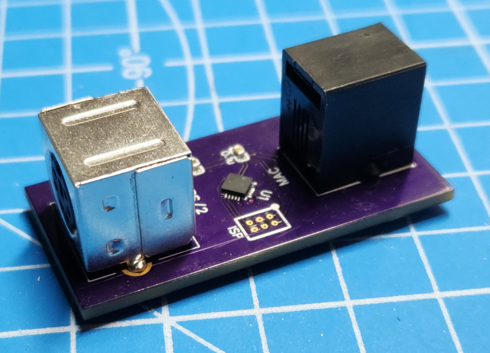

# ATtiny806-based PS/2 to Mac Plus Keyboard Adapter

## About
This is a PS/2 to Mac Plus keyboard adapter based on an ATtiny806 microcontroller.

Why use an ATtiny806? Because I bought a bunch for [a different project](https://github.com/ruthsarian/RuthsarianBladeController), ran into memory and program space issues and moved to [a different microcontroller](https://www.microchip.com/en-us/product/attiny1606). Thus I have several laying around that need to be put to use, such as this!

This sketch is a fork of [trekawek's mac-plus-ps2 repository](https://github.com/trekawek/mac-plus-ps2). Trakawek has done all the heavy-lifting, I've just modified this project to work with the [ATtin806](https://www.microchip.com/en-us/product/attiny806). The key modification being that the scan code translation tables have been pre-calculated and stored as const type variables. This allows the variables to be stored in program space rather than memory.

## Hardware
The PCB is available [through OSHPark](https://oshpark.com/shared_projects/Ghm76ref). You can order a copy of the PCB through OSHPark or download the gerber files and order the PCB from some other manufacturer. The BOM is provided in the project description of the project on OSHPark. The ISP header on the PCB follows the [standard UPDI pinout](https://onlinedocs.microchip.com/pr/GUID-DDB0017E-84E3-4E77-AAE9-7AC4290E5E8B-en-US-4/index.html?GUID-9B349315-2842-4189-B88C-49F4E1055D7F), but includes the RX (pin 4) and TX (pin 5) of the 806's USART port allowing for serial debugging if needed. 

## Compiling & Programming

To compile this code you'll need to use the Arduino IDE and [megaTinyCore](https://github.com/SpenceKonde/megaTinyCore).

To program you'll need to use either [jtag2updi](https://github.com/SpenceKonde/jtag2updi) or [SerialUPDI](https://github.com/SpenceKonde/megaTinyCore#UPDI-Programming) along with a 2x6, 1.27mm pitch programming header interface. I have designed [a PCB for this which you get through OSHPark](https://oshpark.com/shared_projects/KFOWave7), but assembly is required. There may be other options out there such as [ElectronutLabs's PogoProg, Model D](https://gitlab.com/electronutlabs-public/ElectronutLabs-PogoProg).

## References
 
* [trekawek's Arduino-based PS2 -> Macintosh Plus keyboard adapter](https://github.com/trekawek/mac-plus-ps2)
* [megaTinCore - an Arduino core for tinyAVR 0/1/2 series microcontrollers](https://github.com/SpenceKonde/megaTinyCore)
* [Mac Plus keyboard rawcodes](https://github.com/altercation/tmk_firrmware_hhkb_teensy2/blob/master/protocol/m0110.c)
* [PS/2 Scan Codes](https://www.vetra.com/scancodes.html)
